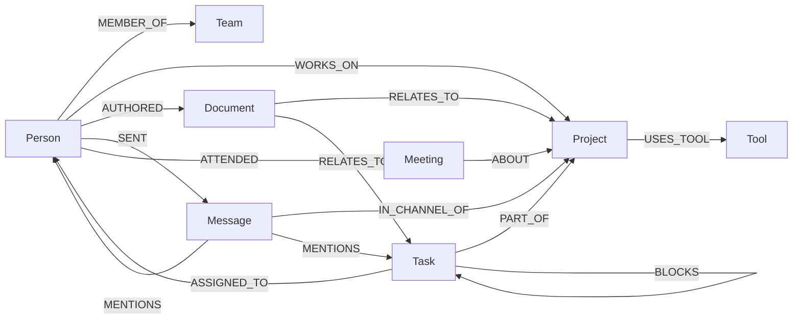
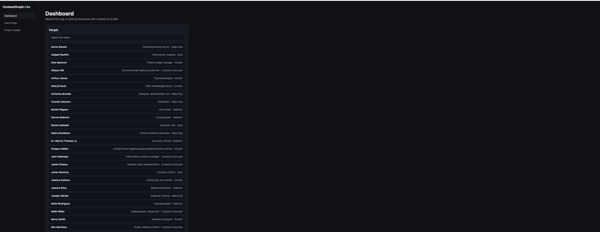
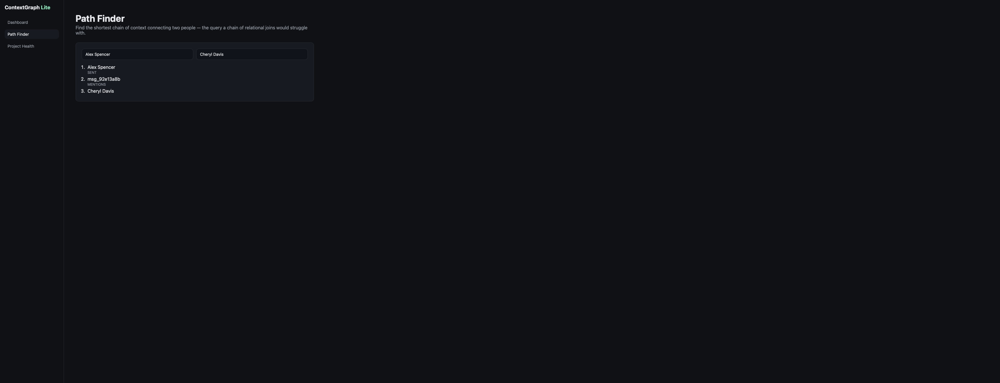
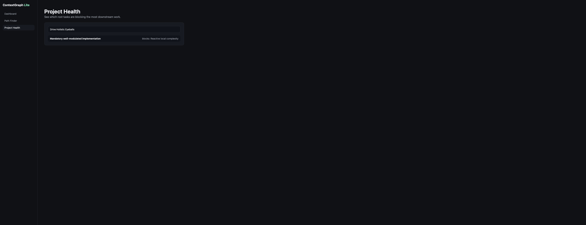

# ContextGraph Lite

A small enterprise "context graph" — given a task, project, or person, find everyone and
everything relevantly connected to it, even indirectly. Built on **CognoDB** as the
graph database layer.

> Built for Wexa AI's CognoDB take-home assignment.

---

## The use case

Modern work is scattered across tools — Slack, email, Jira, docs, meetings — and finding
out "who actually knows about this" means manually piecing together fragments from all of
them. **ContextGraph Lite** models an org as a graph of people, teams, projects, tasks,
documents, messages, and meetings, and lets you ask questions like:

- *Who has relevant context on this task, even if they were never assigned to it?*
- *What's the shortest chain of collaboration connecting two people who've never worked
  together directly?*
- *Which root-cause tasks are blocking the most downstream work?*
- *Who should I ask about this project, that I wouldn't have thought to ask?*

### Why a graph database?

These are all **variable-depth, multi-relationship-type traversal** questions — not
lookups or aggregations. In a relational schema, "everyone within 3 hops of this task"
means a different self-join for every hop, across at least six different join tables
(assignments, mentions, authorship, meeting attendance...), and the query changes shape
if you want 2 hops instead of 3. The shortest-path query is worse: it needs a recursive
CTE with no fixed depth, computed at query time, which relational engines are not built
to do efficiently.

In Cypher, both are a few lines that read like the question itself:

```cypher
MATCH (t:Task {id: $taskId})-[*1..3]-(p:Person)
RETURN DISTINCT p.name, p.title
```

The graph model also degrades gracefully — adding a new relationship type (say, a new
integration) just adds another edge type to traverse, not a new table and a new join to
retrofit into every existing query.

---

## Data model

**Nodes:** `Person`, `Team`, `Project`, `Task`, `Document`, `Message`, `Meeting`, `Tool`

**Relationships:**



Uniqueness constraints are created on every node's `id` property (see `scripts/seed.py`)
so re-running the seed script updates data instead of duplicating it.

---

## Tech stack

| Layer | Choice |
|---|---|
| Database | CognoDB Cloud (free c0 instance), openCypher over Bolt |
| Driver | Official `neo4j` Python driver |
| Backend | Python 3.11 + FastAPI |
| Frontend | React + TypeScript + Vite |
| Seed data | Python + Faker |

---

## Setup

### 1. Create your CognoDB instance

1. Sign up at [console.cognodb.com/signup](https://console.cognodb.com/signup) (no credit
   card required for the free tier).
2. Create a free **c0** instance, pick a region, wait for it to provision (~1 minute).
3. Copy the connection URI (`bolt+s://<instance-id>.databases.cognodb.cloud`) and the
   generated password for the `cognodb` user — **the password is shown once**.

### 2. Configure environment variables

```bash
cp .env.example .env
```

Fill in `COGNODB_URI` and `COGNODB_PASSWORD` in `.env`. This file is gitignored — never
commit real credentials.

### 3. Install dependencies and seed the database

```bash
python -m venv .venv && source .venv/bin/activate   # or your preferred env tool
pip install -r requirements.txt
python scripts/seed.py
```

This loads ~40 people, 6 teams, 10 projects, 120 tasks, 150 documents, 400 messages, 50
meetings, and 6 tools, wired together the way real collaboration actually looks (not
randomly) — including a few deliberate non-obvious chains, so the path-finder demo
returns something more interesting than teammates who already work together directly.

It prints sample ids at the end — grab a few to try in the UI.

### 4. Run the backend

```bash
uvicorn backend.app.main:app --reload --port 8000
```

Visit `http://localhost:8000/docs` for interactive API docs, or `/health` to confirm the
CognoDB connection is live.

### 5. Run the frontend

```bash
cd frontend
cp .env.example .env   # defaults to localhost:8000, adjust if needed
npm install
npm run dev
```

Visit `http://localhost:5173`.

---

## The main queries

| Endpoint | What it does | Why it's graph-native |
|---|---|---|
| `GET /context/task/{id}` | Multi-hop (1–4) traversal to find everyone connected to a task through any relationship type | Variable-depth, multi-relationship-type traversal — awkward as a fixed-shape SQL join |
| `GET /path?from=&to=` | Shortest path of any kind between two people | Needs a recursive CTE with unknown depth in SQL; native in Cypher |
| `GET /blockers/project/{id}` | Finds root-cause tasks and everything they transitively block | Self-referential variable-length traversal |
| `GET /experts/{id}` | People who share project context via documents, but aren't on your team | Multi-hop pattern match across two relationship types |

All queries are parameterized through the official driver — see `backend/app/routers/`.
One caveat, documented in `context.py`: Cypher requires the hop-count bound in a
variable-length path (`*1..N`) to be a literal in the query text, not a bound parameter —
it's clamped server-side to 1–4 rather than taken from raw input, so this isn't
string-concatenated user data.

---

## Project structure

```
contextgraph-lite/
├── backend/app/
│   ├── main.py         # FastAPI app + /health
│   ├── db.py           # neo4j driver session management
│   ├── config.py       # env-based settings
│   ├── models.py       # Pydantic response models
│   └── routers/        # one file per query/endpoint
├── scripts/seed.py     # generates + loads seed data
├── frontend/src/
│   ├── api.ts           # fetch wrapper
│   ├── pages/           # Dashboard, Path Finder, Project Health
│   └── components/      # Layout, loading/empty/error states
├── requirements.txt
└── .env.example
```

---

## Deployment (Render + Vercel)

### Backend → Render

1. Push this repo to GitHub.
2. In Render, **New → Blueprint**, point it at the repo. Render will read
   `render.yaml` at the root and create a free web service automatically.
   (No blueprint? New → Web Service, same repo, and set manually:
   - **Build command:** `pip install -r requirements.txt`
   - **Start command:** `uvicorn backend.app.main:app --host 0.0.0.0 --port $PORT`)
3. In the service's **Environment** tab, set:
   - `COGNODB_URI` — your CognoDB Cloud URI
   - `COGNODB_USER` — `cognodb`
   - `COGNODB_PASSWORD` — your CognoDB password
   - `CORS_ORIGINS` — leave a placeholder for now (`http://localhost:5173`); you'll
     update it once you have the Vercel URL in step 3 below.
4. Deploy. Confirm `https://<your-service>.onrender.com/health` returns `{"status":"ok"}`.
   Render's free tier spins down when idle — the first request after a quiet period can
   take ~30–60s to wake up.

### Frontend → Vercel

1. In Vercel, **New Project**, import the same repo.
2. Set **Root Directory** to `frontend` (this repo has both backend and frontend at the
   root, so Vercel needs to know where the actual frontend app lives).
3. Add an environment variable: `VITE_API_URL` = your Render URL from above
   (e.g. `https://contextgraph-lite-api.onrender.com`).
4. Deploy. Vercel picks up `frontend/vercel.json` automatically for the build settings
   and SPA routing.

### Close the loop

Once you have the real Vercel URL, go back to Render's environment settings and set
`CORS_ORIGINS` to it (e.g. `https://contextgraph-lite.vercel.app`), then trigger a
redeploy — otherwise the browser will block requests from the deployed frontend to the
deployed backend.

---

## Screenshots

**Dashboard** — search the org, or pull context for a task:


**Path Finder** — shortest chain of context between two people:


**Project Health** — root blockers and what they're holding up:


## Demo

- **Hosted app:** https://contextgraph-lite.vercel.app
- **API:** https://contextgraph-lite.onrender.com
- **Screen recording:** https://drive.google.com/file/d/1qDhx3KdfZA0m01ldr90ETn1CvWuQGNjk/view?usp=drive_link
